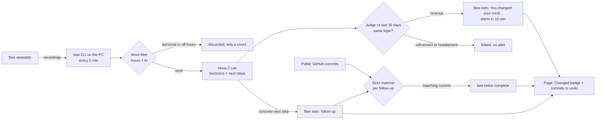

# Why

**Bee turns your work sessions into a visual log of decisions: what you decided, why, and what is still open. Ask it "why did I decide that?" and it answers out loud.**

Why listens (through a [Bee](https://bee.computer) wearable) to the owner's real working conversations, in Spanish, and writes a daily log in English: each decision, the reason behind it, a short quote, the to-dos and the open questions, linked to the public GitHub commits that followed. It is fully serverless on AWS. Built for the Bee track of *Build, Ship, Shape: Amazon Developer Hackathon* (2026).

## For judges

### Judges' quick path (3 minutes)

1. **Open the [demo](https://dxhdmlf1bzl03.cloudfront.net/?demo)** and read one day: decisions, the reason for each, a short quote, linked commits, and the line "N personal conversations ignored".
2. **For coding agents**: connect Claude Code to the live demo with one command, `claude mcp add --transport http why-demo https://dxhdmlf1bzl03.cloudfront.net/mcp`, then ask it: "Use Why to check this change: switch the answer model to Claude Sonnet." It calls `why_check_change` and reports any past decision the change would contradict (setup and the five tools: [docs/agents.md](docs/agents.md)).
3. Look for a **Changed** badge: a decision that directly contradicts an earlier one, with both days linked and the old decision's commits listed as "work that may need undoing". Follow-ups show **open** or **closed by a commit**.
4. **Ask** by voice or text: "What did I decide about ...?" The answer cites its sources; an unknown topic gets "I couldn't find that", never an invented answer.
5. **Alexa**: the same question out loud through the skill "Why decisions" (steps in [Ask Alexa](#ask-alexa); it runs in the developer console simulator).
6. **Bee itself**: the reversal alert and the follow-ups are Bee todos in the owner's own Bee app (see [How reversal alerts and Bee todos work](#how-reversal-alerts-and-bee-todos-work)); the [video](docs/video-script.md) script shows them arriving.
7. Evidence: [docs/security.md](docs/security.md), [friction-log.md](friction-log.md), [docs/product-feedback.md](docs/product-feedback.md), the [Verified](#verified) table, and [Measured accuracy](#measured-accuracy).

### What changed since 3 October

Why started as a daily decision log. It now acts while you work:

| Before (3 Oct) | Now |
| --- | --- |
| Synced every 30 minutes, everything Bee heard went to analysis | Listens all day but filters first: work hours plus an AI work-or-personal check, personal speech is discarded before storage (only a counter stays); sync every 5 minutes |
| A log you read afterwards | **Reversal alerts**: when a new decision directly contradicts an earlier one, Why writes a todo into Bee ("You changed your mind about X: old -> new. Confirm?") with an alarm 10 minutes later |
| Pending items were text on a page | **Follow-ups written to Bee as todos**, completed by Why when a matching public commit lands |
| Ask by page, voice via the browser | Also **Alexa**: "what did we decide about ..." (skill and endpoint in the repo, simulator) |
| A log for people | **Also for coding agents**: MCP tools check a planned change against past decisions, locally or through a public read-only endpoint ([docs/agents.md](docs/agents.md)) |
| No quality number | A local labeling tool and `npm run accuracy` so precision and recall can be measured on a real day ([Measured accuracy](#measured-accuracy)) |
| 151 tests | 308 tests, the domain rules (work filter, reversal, follow-up) written as approved examples in `domain/` |

### Try the live demo, nothing to install

**[Open the demo](https://dxhdmlf1bzl03.cloudfront.net/?demo)** (read-only, no sign-in).

What to try:

- Open a day from the list and read its decisions, reasons, pending items and linked commits.
- Ask by voice (microphone button) or by typing, for example **"What did I decide about ...?"** with a topic you saw in the list. The answer cites the decisions it came from, and Amazon Polly speaks it.
- Ask something that is not in the log. It says "I couldn't find that in your log." instead of inventing an answer.

What is real and what is filtered:

- The data is the owner's **real Bee recordings**, not a script. Nova 2 Lite extracted the log from Spanish speech.
- The demo shows **only days the owner reviewed and published**. Before publishing, the owner previews a filtered copy: emails, phone numbers, card numbers and credential links are redacted, names of other people become a role ("a colleague"), original-language quotes are dropped, and the owner can exclude whole sessions.
- Raw transcripts and unpublished days never reach the demo: it runs on a separate Lambda whose IAM role can read only `PUB#` keys (see [Security](#security-and-privacy)).
- The private site (same URL without `?demo`) is for the owner only: Cognito sign-in with TOTP MFA.

### Run the tests and the mock UI locally

Needs Node.js 24, no AWS account:

```bash
npm ci
npm test
npm run web:dev       # open http://localhost:5173/?mock and ?mock&demo
```

## How it works

```
 Bee (Apple Watch)
        |  recordings
        v
 `bee` CLI on the owner's PC  --every 5 min-->   sessions (split at >20 min gaps,
        |                                         finished after 30 min quiet)
        v
 Amazon Bedrock: Nova 2 Lite  (forced tool call + zod schema)
        |  decisions, why, quotes, pending, open questions (English)
        v
 day log + public GitHub commits (<= 3 per decision)
        v
 DynamoDB (own KMS key; raw transcript expires in 30 days)
        |                                   
        +--> private page  (CloudFront + S3, Cognito + MFA, Lambda API)
        |        owner previews, approves
        v
 filtered copy (PUB#)  --->  demo page  (separate read-only Lambda; Ask + Polly)
```

### How reversal alerts and Bee todos work



- **Reversal means a direct contradiction on the same topic** ("use Nova" then "use Claude Sonnet"). A narrowing ("Nova with reasoning") is linked as a refinement and a repeat ("as we said, Nova") is neither a new decision nor an alert, so the alerts stay rare and meaningful. The rule and its approved examples are `domain/rules/w02.yaml`; the same examples are in the judge's prompt and in the tests.
- **A chain stays readable**: A, then B, then back to A shows both steps, not just the last.
- **Follow-ups**: a decision with a concrete next step becomes one Bee todo in the owner's own words. A commit closes it only when a strict per-follow-up matcher agrees; a commit that mentions two decisions closes both only if each passes.
- **Idempotent writes**: every decision has a stable id and a record that holds the Bee todo id, written with conditional versioned writes, so a todo is never created twice. The PC sync is the single writer. If Bee is offline or signed out the run finishes the rest and retries next run; a todo that keeps failing is given up after five attempts. Old decisions (over 24 hours) are linked but never alert, and a run writes at most eight todos.
- Code: `src/relate.ts` (judge, alert text, closer), `src/ledger.ts` (records and `reconcile`), `src/bee/todos.ts` (the `bee todos` commands).

### Privacy: what is and is not stored

- **Work filter before storage.** Outside the work hours, speech is cut off per utterance; inside, each finished session segment gets one classifier call, and a personal one is dropped. Personal or off-hours text is never stored, never sent to the analysis model and never logged; the only trace is a counter ("N personal conversations ignored"). If the classifier keeps failing for a segment, its text is discarded too (an id and a count remain).
- **Nothing personal is stored.** The log keeps extracted decisions, reasons and short quotes. Raw utterances of work sessions expire after 30 days. The Bee token never leaves the PC.
- **Bystanders.** Bee hears other people. Before anything is public, the owner previews a filtered copy: emails, phone and card numbers and credential links are redacted, other people's names become a role ("a colleague"), original-language quotes are dropped and whole sessions can be excluded. The demo reads only that copy, through an IAM role that can read only `PUB#` keys.
- **Bee todos are short and redacted**: an alert carries a topic and two clipped decisions (at most 120 characters), not a quote.
- Details and the test behind each control: [docs/security.md](docs/security.md).

### Why this is not just a log

A log-only tool records and waits for you to read it. Why:

- runs **live on real Bee data** (not a mocked feed), every 5 minutes;
- **acts inside Bee**: the alert and the follow-ups are Bee todos in the app the owner already checks, and they close themselves when the work lands;
- **filters ambient audio by itself**, so an always-on wearable does not become a surveillance log;
- is reachable as a **page and by voice** (browser microphone and Alexa), with cited answers only;
- shows **its own quality**: the domain rules are approved examples that run as tests, and accuracy is measured against the owner's own labels.

- **Collect on the owner's PC.** Bee's API uses a private certificate authority and the token lives in the OS credential store, so the collector (`src/collect.ts`, `src/cli/sync.ts`) runs locally with the `bee` CLI. A Windows scheduled task runs it every 5 minutes with a least-privilege IAM user. The Bee token never reaches AWS.
- **Sessions.** Each conversation is cut into sessions at pauses longer than 20 minutes; a session is processed once it has been quiet for 30 minutes.
- **Work filter (W-01).** Bee listens all day, so Why filters before it stores anything. Speech outside the work hours (default Monday to Saturday, 09:00 to 20:00, `America/Mexico_City`; set `WORK_DAYS`, `WORK_START`, `WORK_END`, `TIME_ZONE` to change) is cut off, so a conversation that runs past 20:00 keeps only its working part. Each finished session segment inside the hours then gets one small classifier call (Nova 2 Lite, the segment text only) that answers work or personal. Personal and out-of-hours segments are never stored and never sent to the analysis model; only a per-day counter remains, shown on the page as "N personal conversations ignored". If the classifier fails, the segment is neither stored nor dropped: it waits and is retried on the next run. The rules and examples live in `domain/` (`npm run domain:check`).
- **Analyze.** Amazon Nova 2 Lite on Bedrock reads one session with forced tool use; the reply must pass a zod schema (retried once). It returns decisions, the reason for each, a short quote, pending items and open questions, in English, from Spanish speech (`src/analyze.ts`).
- **Compile and link.** Sessions are merged into a day log (`src/compile.ts`) and each decision is linked to up to three public GitHub commits from that time window (`src/github.ts`).
- **Store.** DynamoDB with a customer-managed KMS key. Raw utterances carry a 30-day TTL; the log keeps only extracted decisions, reasons and short quotes.
- **Review and publish.** The owner previews and approves a filtered copy: deterministic redaction, a model review that replaces names, then a second deterministic pass (`src/redact.ts`, `src/publish.ts`).
- **Ask.** The demo and the private page search the log and answer through Nova with citations; any answer without a valid citation is replaced by a fallback. Polly voices the reply (`src/ask.ts`, `src/speech.ts`).

## Ask Alexa

A custom Alexa skill, **Why decisions** (en-US), answers "what did we decide about ..." out loud from the **public demo copy** only. It has no Echo requirement: you test it in the developer console simulator.

- Skill package: `skill-package/` (invocation name "why decisions", `AskWhyIntent` with an `AMAZON.SearchQuery` slot). Privacy policy: `/privacy.html` on the site.
- Endpoint: the `Alexa` Lambda behind a Function URL (stack output `AlexaEndpoint`). Alexa cannot sign with IAM, so the function itself checks the certificate URL and chain, the request signature (SHA-256 or SHA-1), a timestamp within 150 seconds, and the skill id, and rejects everything else before touching data or the model. Its role can read only `PUB#` keys, so private days are unreachable. With no skill id configured it rejects every request.
- Answer: the same `ask` logic as the page, at most two spoken sentences, a simple card, and "I couldn't find that in the decision log" when nothing matches (when the certificate fetch plus the model take over 7 seconds of Alexa's 8, it says "that is taking too long, try again" instead).

Simulator steps (account with the ASK CLI logged in: `ask configure`):

```bash
# 1. First deploy (creates the endpoint; the skill id is still empty, so requests are rejected)
npm run web:build
AWS_PROFILE=counterpart AWS_REGION=us-east-1 npm run cdk -- deploy -c ownerEmail=<email> -c repos=<repos> -c beeMode=cli
# 2. Put the AlexaEndpoint output into the manifest and create the skill
sed -i 's#https://REPLACE-WITH-ALEXA-ENDPOINT.lambda-url.us-east-1.on.aws/#<AlexaEndpoint output>#' skill-package/skill.json
ask deploy --target skill-metadata
ask status          # shows the skill id (amzn1.ask.skill....)
# 3. Put the skill id in cdk.json (context.alexaSkillId) and redeploy, so the function accepts only this skill
AWS_PROFILE=counterpart AWS_REGION=us-east-1 npm run cdk -- deploy -c ownerEmail=<email> -c repos=<repos> -c beeMode=cli
```

Then open the skill in the [Alexa developer console](https://developer.amazon.com/alexa/console/ask), go to **Test**, set "Skill testing is enabled in" to **Development**, and type or say `open why decisions`, then `what did we decide about <a topic from the demo>`. Publish at least one day first, otherwise the answer is the "couldn't find" fallback. The skill id lives in `cdk.json`, so later deploys keep it (`-c alexaSkillId=...` overrides it).

## Security and privacy

The data is a person's spoken conversations, so the design starts from the worst leak. Highlights:

- **Owner-only private site.** One Cognito user, self sign-up off, TOTP MFA required, OAuth code flow with PKCE; every private route verifies the id token.
- **Demo isolation by IAM, not just code.** A separate Lambda role may only `GetItem`/`Query` keys beginning `PUB#`, so it cannot read a private day even if the code were wrong. A private day and a missing day return the same 404.
- **Secrets stay local.** The Bee token never leaves the owner's PC. The sync IAM user can touch only the table, its key (via DynamoDB) and Nova; its access key sits in a local profile and can be revoked.
- **Encryption and transport.** Own KMS key with rotation, HTTPS only, private S3 bucket behind CloudFront OAC, Function URLs with `AWS_IAM` reachable only through the distribution.
- **Personal data.** Three-step publish gate with a mandatory preview; the guarantee never depends on the model.
- **Prompt injection.** Transcript, question and log are treated as data; the model has no actions (one forced tool, or answer plus citations); wrapper tags are neutralised; citations are validated; the page escapes all text.
- **No text in logs, cost capped.** Logs carry ids, counts and timings only. The demo has a per-IP and daily limiter (best effort; no WAF, a known gap).
- **Guard rails in the build.** `cdk-nag` (AWS Solutions pack) runs on the stack and every accepted finding is suppressed individually with a reason.

Full threat model, each control with the code that implements it and the test that proves it: **[docs/security.md](docs/security.md)**. How Bee's API behaves, as investigated for this project: [docs/bee-api.md](docs/bee-api.md).

## Verified

Each claim, how to check it yourself, and the evidence.

| Claim | How to check | Evidence |
| --- | --- | --- |
| Why runs on real Bee data, and we recorded how Bee really behaves | Read the friction log and [docs/bee-api.md](docs/bee-api.md) | [friction-log.md](friction-log.md) entries 1 to 7 give observed shapes (a conversation stuck `CAPTURING` for 20+ hours, `transcriptions[].utterances`, the private CA); entry 1 is reported upstream: [bee-cli issue 21](https://github.com/bee-computer/bee-cli/issues/21) |
| Reversal alerts arrive as Bee todos | `npx vitest run test/ledger.test.ts test/ledger-safety.test.ts test/bee/todos.test.ts`; watch the video | Tests `creates todos and reports counts only, and survives a Bee outage` and `saves the todo as creating before calling Bee`; [video script](docs/video-script.md) shot 4 (0:45 to 1:12) |
| Follow-ups close when a matching commit lands | `npx vitest run test/ledger.test.ts` | `judges a commit once per follow-up, ignores older commits, and shows closed on the page data`; video shot 6 (1:22 to 1:42) |
| Personal speech is discarded before storage | `npx vitest run test/workfilter.test.ts`; read the Data minimization section of [docs/security.md](docs/security.md) | Work-hours and work-or-personal check tests in `test/workfilter.test.ts`; only a counter is stored |
| The public demo reads only `PUB#` keys | `npx vitest run test/infra/stack.test.ts`; read the Least privilege section of [docs/security.md](docs/security.md) | The demo and MCP functions' IAM statements carry the condition `dynamodb:LeadingKeys` = `PUB#*`, with `GetItem`/`Query` only (`test/infra/stack.test.ts`) |
| The MCP endpoint is live | `curl -s -X POST https://dxhdmlf1bzl03.cloudfront.net/mcp -H 'content-type: application/json' -H 'accept: application/json, text/event-stream' -d '{"jsonrpc":"2.0","id":1,"method":"tools/list"}'` | Lists `why_check_change`, `why_explain_commit`, `why_search`, `why_ask`, `why_open_followups`; calls straight to the function URL are refused (403) |
| The agent check finds conflicts (*synthetic, 12 cases*) | `npm run bench` (needs Bedrock access); cases in `test/agent/bench-cases.ts` | Run 2026-10-09 with `us.amazon.nova-2-lite-v1:0`: conflicts precision 1.00, recall 1.00, F1 1.00 (tp 5, fp 0, fn 0); overall accuracy 0.83 (10/12); both misses were clear cases judged as refines, the safe direction. 12 invented cases (5 conflicts, 3 refines, 4 clear), not real decisions |
| Extraction quality on a real day | `npm run accuracy` after `npm run label` ([Measured accuracy](#measured-accuracy)) | Pending owner labels. No number is claimed until a real day is labeled |
| The test suite passes | `npm test` | 308 tests passing |

## Measured accuracy

Does Why find the decisions a person really made? `npm run label` and `npm run accuracy` measure it on one real day, locally:

```bash
# 1. Your own AWS profile (the sync user works). Serves http://127.0.0.1:4173 on this PC only.
AWS_PROFILE=why-sync TABLE=<table> npm run label
# 2. In the page: pick a day, mark each of Why's decisions "real" or "not a decision", add what it missed, save.
#    Labels go to data/labels-<day>.json (git-ignored, never uploaded).
# 3. Prints numbers only (precision, recall, F1):
AWS_PROFILE=why-sync TABLE=<table> npm run accuracy -- --day YYYY-MM-DD
```

The page shows the day's utterances, so it runs only on the owner's machine with the owner's credentials; it is never deployed. A Why decision matches a real one when their word overlap is at least 0.8 (the same helper the rest of Why uses); wording you add yourself is matched the same way, so the measure is conservative.

| Day | Why decisions | Real decisions | Precision | Recall | F1 |
| --- | --- | --- | --- | --- | --- |
| *to be filled by the owner* | | | | | |

No number is claimed until the owner has labeled a day.

## Evidence

What exists today:

- Test suite: **308 tests**, passing (`npm test`), covering the MCP tools and the public endpoint, the analyzer, the work filter, reversal and follow-up logic with the approved domain examples, redaction, publishing, the API, the Alexa endpoint, the CDK stack's IAM and CloudFront settings, the labeling tool and the web renderer.
- Friction log and product feedback: [friction-log.md](friction-log.md), [docs/product-feedback.md](docs/product-feedback.md).
- Security document with a test named for every control: [docs/security.md](docs/security.md).
- `cdk-nag` AWS Solutions checks run on every synth; the stack synthesizes clean, with each suppression justified in `infra/lib/why-stack.ts`.
- A `test/security.test.ts` that scans the source and fails if a log call could carry conversation text or if real data is committed.

Reliability battery (`npm run battery`, results to `docs/evidence/battery.json`): **coming**. No numbers are claimed until it has run.

## Built with

- **Wearable:** Bee (Apple Watch), read through the `bee` CLI.
- **AI:** Amazon Bedrock with Amazon Nova 2 Lite (extraction, name review, Ask); Amazon Polly (spoken answers).
- **Compute and API:** AWS Lambda (a private API function and a separate demo function), Lambda Function URLs with `AWS_IAM` auth via CloudFront origin access control.
- **Data and keys:** Amazon DynamoDB with TTL, AWS KMS (customer-managed key).
- **Identity:** Amazon Cognito (user pool, TOTP MFA, PKCE).
- **Delivery:** Amazon CloudFront, Amazon S3.
- **Operations:** Amazon CloudWatch alarm and Amazon SNS email on errors.
- **Infrastructure as code:** AWS CDK (TypeScript) with `cdk-nag`.
- **Code:** TypeScript on Node.js 24, zod, aws-jwt-verify, Vite for the web page, Vitest.

No servers, containers, load balancers or NAT gateways.

## Run it yourself

Prerequisites: Node.js 24+, an AWS account with Bedrock access to Nova 2 Lite in `us-east-1`, AWS CDK bootstrapped there, AWS CLI credentials for deploying, and the Bee CLI (`@beeai/cli`) signed in on the PC that will sync.

```bash
git clone https://github.com/Raul99Alejandro/why.git && cd why
npm ci
npm test                 # unit and infrastructure tests, no AWS calls
npm run typecheck
npm run web:dev          # local preview with mock data: http://localhost:5173/?mock
```

### Deploy

```bash
npm run web:build        # builds dist-web, which the stack uploads to S3
npm run cdk -- deploy -c ownerEmail=you@example.com -c repos=your-user/repo1,your-user/repo2 \
  --outputs-file cdk-outputs.local.json
```

Context flags:

- `ownerEmail` (required): the one Cognito user, who receives the invite and the alarm email.
- `repos`: public GitHub repositories (`owner/name`, comma separated) to look up commits in.
- `beeMode`: `cli` (default, recommended: sync on your PC) or `http` (token in Secrets Manager; also set `beeBaseUrl`).

Outputs include `SiteUrl`, `DemoUrl` (`SiteUrl?demo`), `UserPoolId`, `ClientId` and `SyncUserName`. Sign in at `SiteUrl`, set a password and enrol your authenticator app (TOTP).

### Owner sync (your PC, `beeMode=cli`)

1. In the IAM console create an access key for the `SyncUserName` user. Save it only in the `why-sync` profile of `~/.aws/credentials`. Never commit it.
2. Run once by hand to check it: `AWS_PROFILE=why-sync TABLE=<table name from cdk-outputs.local.json> npm run sync` (it prints counts only).
3. Register the scheduled task (Windows, PowerShell, as your user): `powershell -File scripts/register-sync-task.ps1`. It runs "Why Bee sync" every 5 minutes while you are logged on and logs counts to `%LOCALAPPDATA%\why\sync.log`. Remove it with `scripts/unregister-sync-task.ps1`.
   To change the schedule, edit `-RepetitionInterval` in `scripts/register-sync-task.ps1` and run it again (it replaces the existing task). The day log of today is rebuilt at most every 30 minutes when nothing new arrived, so the 5-minute run stays cheap.
4. In the private site, review a day, preview the filtered copy, and publish it. Only then does it appear in the demo.

The sync's repo list and time zone are set in `src/cli/sync.ts`; edit them for your own use.

### Teardown

```bash
npm run cdk -- destroy
```

The table, key and bucket are set to be destroyed with the stack. Delete the sync user's access key and the `why-sync` profile, and unregister the scheduled task.

## Project layout

```
src/
  collect.ts, analyze.ts, compile.ts, publish.ts   pipeline: sessions, analysis, day log, publish gate
  workfilter.ts                                    work hours and the work-or-personal classifier
  relate.ts, ledger.ts, bee/todos.ts               reversal judge, decision ledger, Bee todos
  alexa/                                           Alexa request verification and the skill
  agent/                                           MCP tools for coding agents (check, explain, search, ask, follow-ups) and the check benchmark
  label/, cli/label.ts, cli/accuracy.ts            local labeling page and accuracy numbers (never deployed)
  redact.ts, untrusted.ts                          redaction and prompt-injection defenses
  ask.ts, speech.ts, nova.ts, github.ts            Ask, Polly, Bedrock client, commit lookup
  api/                                             router, auth, demo rate limits
  bee/                                             Bee sources (CLI, optional HTTP)
  store/                                           DynamoDB and in-memory stores
  handlers/                                        Lambda entry points (api, demo, sync)
  cli/sync.ts                                      the owner's local sync
skills/why/SKILL.md                                Agent Skill: when a coding agent should ask Why (setup: docs/agents.md)
domain/                                            glossary and rules (work filter, reversals, follow-ups) with examples
web/                                               browser UI (Vite, TypeScript), with a mock backend
infra/                                             CDK app and the single stack (+ cdk-nag)
scripts/                                           Windows scheduled-task scripts for the sync
docs/                                              security.md, bee-api.md, product-feedback.md, video-script.md
test/                                              Vitest suites (unit, store contract, CDK stack, web)
```

## Built for the hackathon

Entry for the **Bee track** of *Build, Ship, Shape: Amazon Developer Hackathon 2026*, built in October 2026 (design on 3 October).

**Built with AI assistance.** The design, code, tests and this documentation were produced with Claude Code (Anthropic) working under the owner's direction, in a test-first workflow with review passes. The owner chose the product, reviewed the results, handles the credentials and the Bee device, and approves every published day.

## License

MIT, see [LICENSE](LICENSE).
